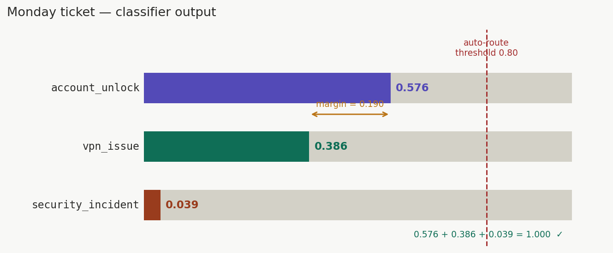
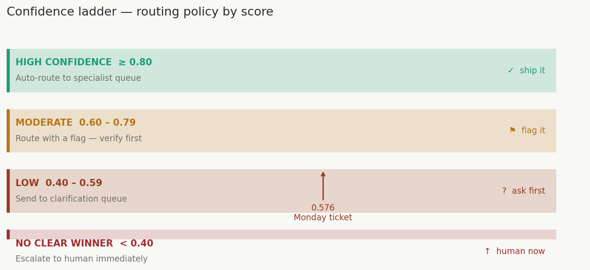
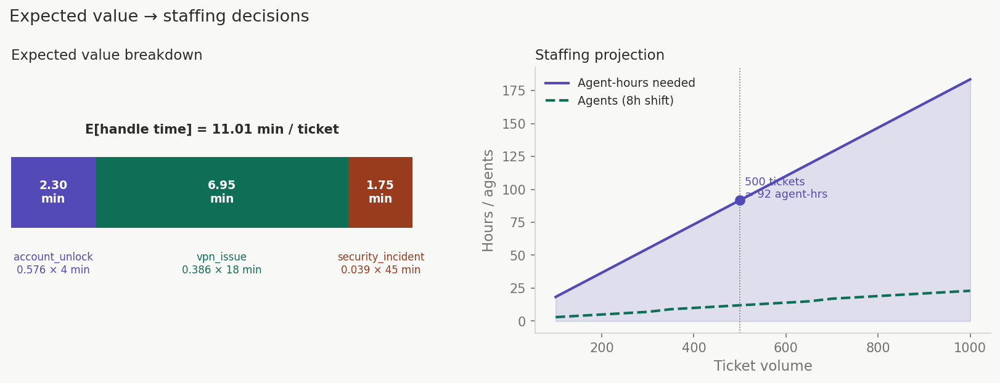
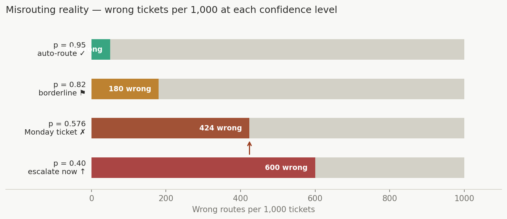

# Module 2: Probability Refresher for AI

## Start here: What does "0.576 probability" actually mean?

Picture a traffic light. It doesn't tell you *whether* an accident will happen — it tells you *how much to trust* the current flow of traffic before you step on the gas.

Model probabilities work the same way.

When your classifier returns this for the Monday ticket:

```
account_unlock:    0.576
vpn_issue:         0.386
security_incident: 0.039
```

It is **not** saying: *"I am 57.6% sure this is an account unlock."*

It is saying: *"Given everything I've learned, account_unlock fits the pattern better than the other options — and here's how much better."*

The model is expressing **relative preference**, not absolute truth. That distinction will save you from bad routing decisions.

---

## The two rules that can never break

No matter what model you use, no matter what the ticket says, these two rules must always hold:

$$
\sum_{i=1}^{n} P(i) = 1 \qquad \text{and} \qquad 0 \le P(i) \le 1
$$

**In plain English:**
1. All probabilities across all classes must add up to exactly 1 (100%)
2. No probability can be negative or greater than 1

**Why you should care operationally:** If your model outputs `[0.576, 0.386, 0.100]` — that sums to 1.062, not 1.0. That's a red flag. Either the output wasn't normalized, something broke in post-processing, or you're reading raw logits instead of probabilities. Any downstream routing logic built on that is already wrong.

> **Quick sanity check to run in every pipeline:**
> ```python
> assert abs(sum(probs.values()) - 1.0) < 1e-6, "Probabilities don't sum to 1!"
> ```

---

## The formula that answers "how much time will this cost us?"

Once you have valid probabilities, you can calculate **expected value** — what you should *plan for* on average across many tickets.

$$
\mathbb{E}[X] = \sum_{i=1}^{n} x_i \cdot P(i)
$$

Where $x_i$ is the cost (in minutes, dollars, headcount) for handling intent $i$.

### Real example: staffing your Monday morning queue

Say your model has classified today's incoming 500 tickets with these probabilities
(the same distribution as the Monday ticket):

| Intent | Probability | Avg. Handle Time |
|---|---|---|
| `account_unlock` | 0.576 | 4 min |
| `vpn_issue` | 0.386 | 18 min |
| `security_incident` | 0.039 | 45 min |

> **These are the canonical Monday ticket probabilities** — derived from logits
> `[3.2, 2.8, 0.5]` via softmax (you'll see exactly how in Module 3).

Expected handle time per ticket:

$$
\mathbb{E}[X] = (0.576 \times 4) + (0.386 \times 18) + (0.039 \times 45)
$$
$$
= 2.304 + 6.948 + 1.755 = \textbf{11.01 minutes per ticket}
$$

500 tickets × 11.01 min = **5,505 minutes = ~92 agent-hours needed today.**

Now you're not guessing at staffing. You're planning from data.

---

## The routing decision: when to act, when to pause

Back to the Monday ticket with these scores:

```
account_unlock:    0.576  ← top class
vpn_issue:         0.386
security_incident: 0.039
```

Your policy says: **auto-route only if the top class hits 0.80 confidence.**

This ticket fails. Here's why that matters:

The gap between `account_unlock` (0.576) and `vpn_issue` (0.386) is only 0.190.
That's not decisive — it's uncertain. If you auto-route to account unlock and it's
actually a VPN issue, you've sent the ticket to the wrong team, wasted a handler's
time, and frustrated the user. And if it's actually a security incident, the
consequences are far worse.

The correct response is to **route to clarification** — ask one confirming question,
or send to a human reviewer — before taking action.

> **Note:** You'll see exactly where `[0.576, 0.386, 0.039]` comes from in Module 3.
> For now, treat them as the model's output. Module 3 opens the black box.

### The confidence ladder (build this into your system)

| Top class score | What it signals     | What to do                                |
|-----------------|---------------------|-------------------------------------------|
| ≥ 0.80          | High confidence     | Auto-route to specialist queue            |
| 0.60 – 0.79     | Moderate confidence | Route with a flag: "verify before acting" |
| 0.40 – 0.59     | Low confidence      | Send to clarification queue               |
| < 0.40          | No clear winner     | Escalate to human immediately             |

The exact thresholds are yours to tune — but **the ladder structure is non-negotiable.** A system with no middle tier will either over-automate (and make expensive mistakes) or under-automate (and defeat the point).

---

## The trap that catches everyone

> *"0.82 confidence? That's basically confirmed. Route it."*

No. Here's the mental model to replace that instinct:

Imagine you flip a weighted coin that lands heads 82% of the time. If you route
1,000 tickets at 0.82 confidence, **180 of them are wrong.** At 100 tickets a day,
that's 18 misrouted tickets daily — silently, with no error message, no alert, no warning.

Now apply that to your Monday ticket at 0.576. Route 1,000 tickets at that confidence:
roughly **424 are wrong.** Nearly half. The model told you — through the low score,
the thin margin of 0.190, and the ambiguous ticket language — that it wasn't sure.
The number is the warning.

This is why you need:
1. A **threshold policy** — written down, agreed upon, not just in someone's head
2. A **fallback behavior** — what exactly happens when confidence is too low
3. **Monitoring** — track whether your model's confidence distribution drifts week-over-week

If your average top-class confidence was 0.78 last month and it's 0.61 this month, something changed. Either your ticket language shifted, or your model needs retraining.

---

# Module 02 — Probability: visualization notes

Four visualizations accompany the Module 02 article. This file describes each one and what it illustrates.

---

## Visual 1 — Classifier output bars

**What it shows:** The raw classifier output for the Monday ticket as three horizontal bars, proportional to probability. A summary panel below shows the sum check (1.000 ✓), the margin between top and second class (0.190 ⚠), and the auto-route threshold check (0.576 < 0.80 ✗).

**Key insight:** The thin margin of 0.190 is as important as the top score of 0.576. A wide bar with a narrow lead is not a confident classification.



---

## Visual 2 — Confidence ladder

**What it shows:** Four routing tiers as a vertical stack of colored bands. Each band shows the score range, what it signals, and what action to take. A pointer arrow marks where the Monday ticket (0.576) lands — in the clarification queue band, not auto-route.

**Key insight:** The ladder makes the routing policy visible. Without it, decisions live in someone's head and vary by analyst. With it, the policy is structural.

| Band | Score | Action |
|:---|:---|:---|
| High confidence | ≥ 0.80 | Auto-route |
| Moderate | 0.60–0.79 | Route with flag |
| Low | 0.40–0.59 | Clarification queue |
| No clear winner | < 0.40 | Escalate immediately |



---

## Visual 3 — Expected value staffing calculator (interactive)

**What it shows:** An interactive slider for ticket volume. Fixed cards show the three components of the expected value calculation:

$$
\mathbb{E}[X] = (0.576 \times 4) + (0.386 \times 18) + (0.039 \times 45) = 11.01 \text{ min/ticket}
$$

Dragging the slider updates: total minutes, agent-hours needed, and agents required for an 8-hour shift.

**Key insight:** At 500 tickets, 11.01 min/ticket = 5,505 minutes = ~92 agent-hours. You are not guessing at staffing — you are planning from the probability distribution.



---

## Visual 4 — Misrouting reality bars

**What it shows:** Four horizontal bars representing four confidence levels (0.95, 0.82, 0.576, 0.40). Each bar is sized to show the number of wrong routes per 1,000 tickets at that confidence level.

| Confidence | Wrong per 1,000 | Status |
|:---|:---|:---|
| 0.95 | 50 | Auto-route safe |
| 0.82 | 180 | Borderline — flag |
| 0.576 | 424 | Monday ticket — do not auto-route |
| 0.40 | 600 | Escalate immediately |

**Key insight:** 0.82 sounds like "basically confirmed." It means 180 wrong tickets per 1,000 — 18 per day at 100 tickets/day, silently, with no error message. The number is the warning.



---

## How to practice this

Open `notebooks/math-foundations/02_probability.ipynb` and work through:

1. Convert raw model scores (logits) into valid probabilities that sum to 1
2. Spot deliberately broken outputs — probabilities that violate the two rules
3. Calculate expected handle time for a sample Monday queue
4. Tune confidence thresholds and watch how your misroute rate changes

---

## What to lock in before moving on

- [ ] Can you explain why 0.576 probability ≠ "57.6% confirmed correct"?
- [ ] Do your pipeline's output probabilities always sum to 1? (add the assert check)
- [ ] Is your threshold policy written down with explicit fallback behavior for each tier?
- [ ] Are ambiguous tickets (0.40–0.60) going somewhere useful, not just silently dropped?
- [ ] Are you tracking confidence distribution drift week to week?

--8<-- "_abbreviations.md"