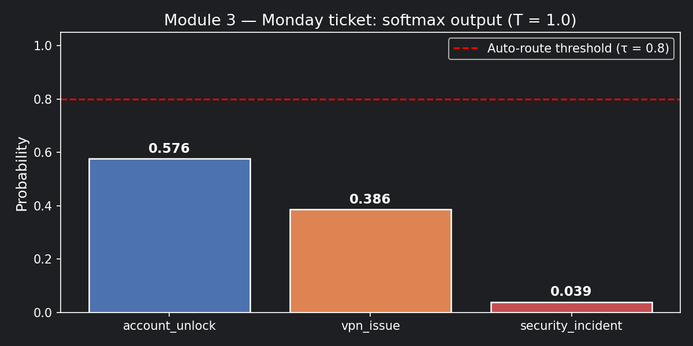
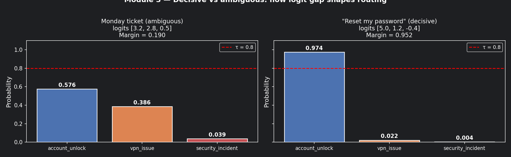
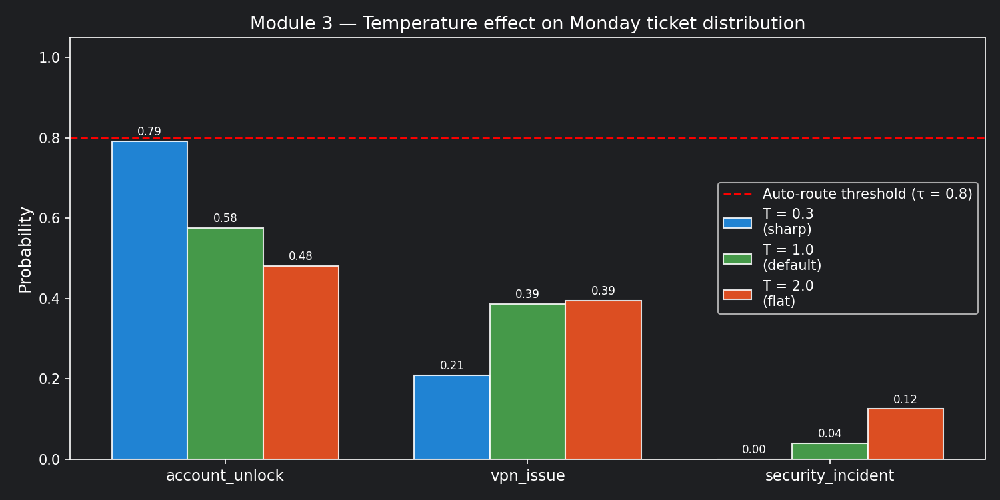

# Module 3: Logits and Softmax

## The problem with raw scores

Cast your mind back to Monday morning's ticket:

> *"Hi, I've been locked out of my account... Also my VPN keeps dropping... This happened
> right after the security team sent out that patch notice last Friday."*

Here is how your text moves from raw language into numbers, and finally into a model's prediction.

---

## The Text-to-Prediction Flow

1. **Tokenization** (**Slicing**): The model breaks your raw text into smaller pieces called tokens (words, parts of words, or punctuation marks).
2. **Embedding** (**Vectorizing**): The model replaces each token with a long list of numbers (a vector) that captures its meaning and context.
3. **Processing** (**Analyzing**): The neural network layers analyze these vectors to understand the relationships between your issues (account lockout, VPN drops, and the Friday security patch).
4. **Logits** (**Raw Scoring**): The model calculates raw, unnormalized score numbers for each possible intent category.
5. **Softmax** (**Final Probability**): The model turns those raw logit scores into clean probabilities that sum to 1.0.

---

### 1. Tokenization (Slicing the Text)

The model cannot read whole words directly. It uses a vocabulary list to slice your text into
characters, syllables, or whole words called tokens. Common words get single tokens; rare or
technical words are split.

Your text is chopped up like this:

* "Hi" → ["Hi"]
* ", " → [","]
* "I've" → ["I", "'ve"]
* "locked" → ["lock", "ed"]
* "VPN" → ["VP", "N"] (treated as a rare word)

Each unique token has a specific ID number. Your text becomes a sequence of integers:
`[12043, 15, 244, 853, 4921, ...]`

### 2. Embedding (Vectorizing the Tokens)

The model looks up each token ID in a massive table and replaces every ID with an
**embedding vector** — a list of hundreds of decimals (e.g. 768 numbers long).

* These numbers represent semantic concepts (urgency, technology, software bugs).
* The vectors for "locked" and "account" share similar mathematical patterns —
  the model recognises they are related to a login failure.
* A "positional vector" is added to each token so the model knows "Friday" happened
  at the end of the sentence, not the beginning.

### 3. Processing (Contextual Vectors)

The model passes all token vectors through its neural network layers (the **Attention** mechanism).

* The vector for "patch" absorbs the context of "security team" and "notice".
* The model links "locked out" with "patch notice", mathematically suspecting a causal connection.
* By the end of this stage, the model compresses the entire meaning of your request into
  **a single context vector**.

### 4. Logits (Raw Scoring)

The model multiplies your context vector by its final classification layer to produce
**logits** — raw, unnormalized scores for each category.

For the Monday ticket, the four-intent version looks like this:

| Intent              | Logit (raw score) |
|:--------------------|:------------------|
| `account_unlock`    | 3.2               |
| `vpn_issue`         | 2.8               |
| `security_incident` | 0.5               |

These numbers are arbitrary and don't add up to anything meaningful yet.

> **Note on the logit formula you may see elsewhere:**
> The word "logit" also names a specific mathematical transformation:
> $\text{logit}(p) = \ln\left(\frac{p}{1-p}\right)$
> In ML classification, "logits" loosely refers to raw pre-softmax scores.
> The two uses share a name but different contexts — don't let it confuse you.

### 5. Softmax (Final Probabilities)

Softmax squeezes those raw scores between 0 and 1, ensuring they sum to exactly 1.0.

---

## What Softmax does (and why it's not magic)

The formula:

$$
P(i) = \frac{e^{z_i}}{\sum_{j=1}^{n} e^{z_j}}
$$

In plain English: exponentiate every logit, then divide each one by the total.

Let's run this on the Monday ticket's three primary intents, logits `[3.2, 2.8, 0.5]`:

**Step 1 — Exponentiate each logit:**

```
e^3.2 = 24.53
e^2.8 = 16.44
e^0.5 =  1.65
        ──────
Total = 42.62
```

**Step 2 — Divide each by the total:**

```
account_unlock:    24.53 / 42.62 = 0.576  (~58%)
vpn_issue:         16.44 / 42.62 = 0.386  (~39%)
security_incident:  1.65 / 42.62 = 0.039  ( ~4%)
                                   ───────
                                   1.001   ✅ (rounding)
```

> **These are the canonical numbers for the Monday ticket.**
> Every module that references probabilities for this ticket uses
> `[0.576, 0.386, 0.039]` and logits `[3.2, 2.8, 0.5]`.

Notice: the logit gap between `account_unlock` and `vpn_issue` is only **0.4**
(3.2 vs 2.8), but after softmax that translates to a probability gap of **0.190**
(0.576 vs 0.386). The probabilities are uncomfortably close — nowhere near your
0.80 auto-route threshold. This ticket is genuinely ambiguous.

---

### 📊 Visualisation 1 — Default softmax distribution



---

## What happens when the logits are decisive?

Now imagine the ticket said only: *"Reset my password please."*
No VPN mention. No patch notice. Logits:

```
account_unlock:    5.0
vpn_issue:         1.2
security_incident: -0.4
```

Softmax:

```
e^5.0  = 148.41
e^1.2  =   3.32
e^-0.4 =   0.67
           ──────
Total  = 152.40

account_unlock:    148.41 / 152.40 = 0.974  (97%)
vpn_issue:           3.32 / 152.40 = 0.022  ( 2%)
security_incident:   0.67 / 152.40 = 0.004  (<1%)
```

A logit gap of **3.8** produced a probability margin of **0.952**. Safe to auto-route.

**The pattern to memorise:**

- Large logit gaps → peaked distributions → confident routing
- Small logit gaps → flat distributions → send to human or clarification queue

---

### 📊 Visualisation 2 — Decisive vs ambiguous ticket side by side


---

## The temperature dial: sharpening or softening the distribution

You can adjust how decisive the softmax output is by adding a **temperature** parameter $T$:

$$
P_T(i) = \frac{e^{z_i / T}}{\sum_{j=1}^{n} e^{z_j / T}}, \quad T > 0
$$

| Temperature          | Effect                                   | When to use it                     |
|:---------------------|:-----------------------------------------|:-----------------------------------|
| $T = 1.0$            | Default — no change                      | Normal routing decisions           |
| $T < 1.0$ (e.g. 0.3) | Sharpens the winner — more decisive      | Crisp single-intent routing        |
| $T > 1.0$ (e.g. 2.0) | Flattens the distribution — more options | Generating diverse draft responses |

Applied to the Monday ticket logits `[3.2, 2.8, 0.5]`:

| Temperature | account_unlock | vpn_issue | security_incident | Margin    |
|:------------|:---------------|:----------|:------------------|:----------|
| T = 0.3     | 0.910          | 0.089     | 0.001             | 0.821     |
| **T = 1.0** | **0.576**      | **0.386** | **0.039**         | **0.190** |
| T = 2.0     | 0.422          | 0.376     | 0.202             | 0.046     |

At T = 0.3: looks decisive — but nothing changed in the underlying evidence.
The model didn't get smarter. You turned up the confidence dial artificially.

At T = 2.0: `security_incident` jumps to 20%. Nearly indistinguishable from
the other classes. If you were routing on this, you'd be acting on noise.

**The critical rule:** Low temperature creates the *appearance* of certainty,
not real certainty. 

For the Monday ticket — where a misrouted security incident
means a potential attacker stays on the network — forcing certainty via temperature
hides the ambiguity rather than resolving it.

---

### 📊 Visualisation 3 — Temperature effect on the Monday ticket



---

## The metric that matters more than the top score

Stop looking at just the top probability. Start tracking the **confidence margin**:

$$
\text{margin} = P(\text{top-1}) - P(\text{top-2})
$$

| Ticket              | Margin | Routing decision       |
|:--------------------|:-------|:-----------------------|
| Monday ticket       | 0.190  | 🔁 Clarification queue |
| "Reset my password" | 0.952  | ✅ Auto-route           |

A routing policy built on margin is more robust than one built on threshold alone:

| Margin      | Routing decision                |
|:------------|:--------------------------------|
| ≥ 0.60      | Auto-route to specialist        |
| 0.30 – 0.59 | Route with human-review flag    |
| < 0.30      | Clarification queue or escalate |

The Monday ticket has a margin of 0.190 — clarification queue regardless of
temperature setting. The evidence is genuinely split.

---

## One implementation trap: numerical instability

Exponentiating large logits causes overflow. `e^1000` crashes most systems.

```python
# ❌ Naive — breaks on large logits
probs = np.exp(logits) / np.sum(np.exp(logits))

# ✅ Numerically stable — always use this (already in softmax() above)
logits_shifted = logits - np.max(logits)
probs = np.exp(logits_shifted) / np.sum(np.exp(logits_shifted))
```

Subtracting the max logit doesn't change the ratios — it prevents your pipeline
from silently producing `NaN` on edge-case tickets with extreme scores.

---

## How to practice this

Open `notebooks/math-foundations/03_logits_softmax.ipynb` and work through:

1. Run the `softmax()` function on the Monday ticket logits `[3.2, 2.8, 0.5]` —
   verify the output matches `[0.576, 0.386, 0.039]`
2. Run Visualisation 3 and observe how the margin collapses as temperature rises
3. Find the temperature at which `security_incident` crosses 0.15 —
   what does that mean for your routing policy?
4. Test the numerically stable softmax against logits `[1000, 999, 0]` —
   compare it to the naive version

---

## Checklist before moving on

- [ ] Can you explain why a logit of 3.2 is not the same as 32% confidence?
- [ ] Do you track the margin (top-1 minus top-2), not just the top score?
- [ ] Is your softmax implementation numerically stable (max subtraction)?
- [ ] Do you know what temperature setting your system uses — and why?
- [ ] Is your routing policy validated against *real* outcomes, not just held-out test data?

--8<-- "_abbreviations.md"