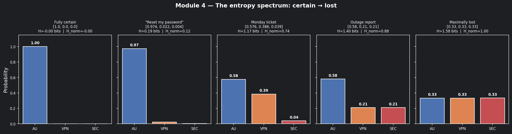
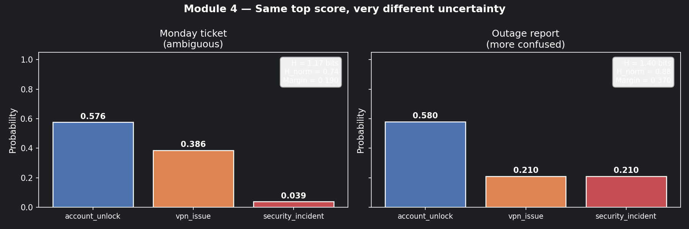
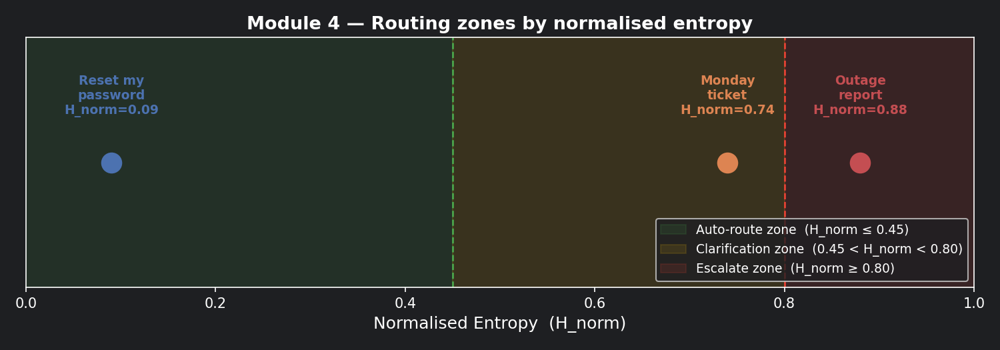
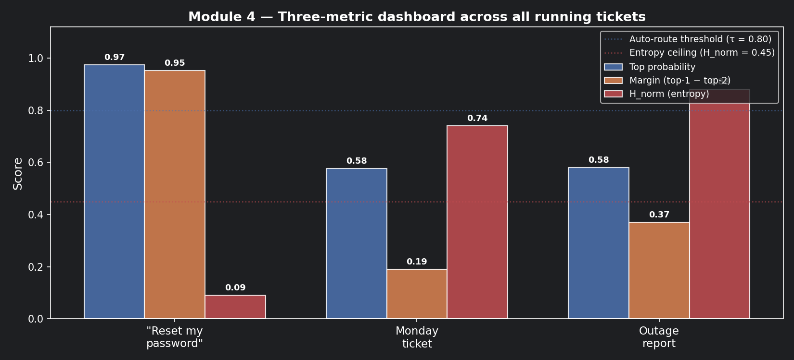
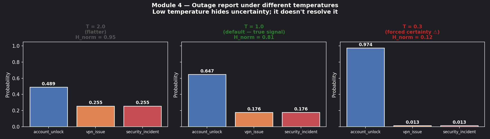

# Module 4: Entropy and Uncertainty

## The problem with only looking at the top score

In Module 3, we left our Monday ticket here:

```
account_unlock:    0.576
vpn_issue:         0.386
security_incident: 0.039
```

Margin = 0.19 — too close to auto-route. We sent it to clarification queue.

Now consider a different ticket that just came in — an outage report:

```
account_unlock:    0.58
vpn_issue:         0.21
security_incident: 0.21
```

The top score is almost identical (0.58 vs 0.576). The margin is different (0.37 vs 0.19).
By the routing rules from Module 3, the outage report actually looks *safer* — higher margin.

But look more carefully. In the outage report, **two classes are tied at 0.21.**
The model isn't just uncertain between first and second — it's equally lost between
second and third. The uncertainty is *spreading*, not concentrating.

Your margin metric can't see this. You need a new tool: **entropy**.

---

## What entropy measures

Entropy is a single number that captures how *spread out* a probability distribution is.

$$
H(P) = -\sum_{i=1}^{n} P(i) \log_2 P(i)
$$

Two anchor points to memorise:

**Entropy = 0** → all probability sits on one class. The model is certain.
```
[1.00, 0.00, 0.00]   →   H = 0
```

**Entropy = log₂(n)** → probability is split perfectly evenly. The model is maximally lost.
```
[0.33, 0.33, 0.33]   →   H = log₂(3) = 1.585 bits
```

Everything else falls between those two poles.

---

### 📊 Visualisation 1 — The entropy spectrum: from certain to lost

This chart shows five distributions along the spectrum from H=0 to H=1.585,
so you can see what "certain", "uncertain", and "maximally lost" actually look like
as bar charts before we apply entropy to our tickets.



---

## Let's calculate it on the Monday ticket

**Ticket 1 — Monday's ambiguous ticket:**

```
P = [0.576, 0.386, 0.039]

H = -(0.576 × log₂0.576) + (0.386 × log₂0.386) + (0.039 × log₂0.039)
  = -(0.576 × -0.796)    + (0.386 × -1.374)    + (0.039 × -4.678)
  =   0.458              +   0.530              +   0.182
  = 1.17 bits
```

**Ticket 2 — The outage report:**

```
P = [0.58, 0.21, 0.21]

H = -(0.58 × log₂0.58) + (0.21 × log₂0.21) + (0.21 × log₂0.21)
  = -(0.58 × -0.786)   + (0.21 × -2.252)   + (0.21 × -2.252)
  =   0.456             +   0.473            +   0.473
  = 1.40 bits
```

Maximum possible entropy for 3 classes = log₂(3) = **1.585 bits**.

| Ticket | Top score | Margin | Entropy | Assessment |
|:---|:---|:---|:---|:---|
| Monday ticket | 0.576 | 0.190 | 1.17 bits | Uncertain — clarification queue |
| Outage report | 0.580 | 0.370 | 1.40 bits | More uncertain — escalate faster |

The top scores are nearly identical. The outage report has a *higher* margin.
But entropy reveals it is closer to maximum confusion — something margin
completely missed.

---

### 📊 Visualisation 2 — Monday ticket vs outage report: side by side

This chart puts the two tickets next to each other with their entropy scores,
making it obvious why margin alone is not enough.



---

## Normalised entropy: comparing across different class counts

Raw entropy values only make sense within the same number of classes.
A 3-class problem maxes at 1.585 bits; a 10-class problem maxes at 3.32 bits.
You can't compare them directly.

Normalise to a 0–1 scale:

$$
H_{norm} = \frac{H(P)}{\log_2 n}
$$

Now 0 always means "fully certain" and 1 always means "fully lost" — regardless of
how many classes your classifier uses.

| Ticket | Raw entropy | Normalised entropy |
|:---|:---|:---|
| "Reset my password" (Module 3) | ~0.15 / 1.585 | **~0.09** |
| Monday ticket | 1.17 / 1.585 | **0.74** |
| Outage report | 1.40 / 1.585 | **0.88** |

---

### 📊 Visualisation 3 — Normalised entropy on a 0–1 scale with routing zones

This is the chart to bookmark. It maps H_norm onto a colour-coded axis with your
three routing zones marked — so you can see at a glance where each ticket lands
relative to the decision boundaries.



---

## The combined routing policy

Each metric from Modules 2–4 catches a different failure mode:

| Failure mode | What it looks like | Which metric catches it |
|:---|:---|:---|
| Model is unsure between top two | Top score 0.60, second 0.55 | **Margin** (Module 3) |
| Model spreads uncertainty widely | Top 0.58, others all similar | **Entropy** (this module) |
| Model looks confident but is often wrong | Top score 0.80, historically 40% wrong | **Calibration** (Module 8) |

A robust routing policy uses all three:

```python
if top_prob >= 0.80 and margin >= 0.60 and H_norm <= 0.45:
    route_to_specialist()          # all three gates pass
elif H_norm >= 0.80:
    escalate_immediately()         # too confused to act safely
else:
    send_to_clarification_queue()  # something didn't clear
```

Applied to our three tickets:

| Ticket | Top prob | Margin | H_norm | Decision |
|:---|:---|:---|:---|:---|
| "Reset my password" | 0.974 | 0.952 | 0.09 | ✅ Auto-route |
| Monday ticket | 0.576 | 0.190 | 0.74 | 🔁 Clarification queue |
| Outage report | 0.580 | 0.370 | 0.88 | 🚨 Escalate immediately |

Three different outcomes from three superficially similar top scores.

---

### 📊 Visualisation 4 — All three tickets: the three-metric dashboard

This chart shows all three metrics side by side for all three tickets —
the most useful view for understanding why each routing decision is different.



---

## Why this matters for security incidents specifically

Misrouting a security incident to a tier-1 agent doesn't just waste time —
it leaves an active threat unaddressed.

Entropy is your last line of defence before auto-routing on ambiguous tickets.
A ticket with H_norm = 0.88 should **never** be auto-routed, regardless of what the
top class says. The model is telling you it genuinely doesn't know. Listen to it.

The instinct to override high entropy with a low temperature setting (from Module 3)
is exactly the wrong move here. Sharpening a confused distribution doesn't resolve
the confusion — it just makes it invisible until something breaks in production.

---

### 📊 Visualisation 5 — What low temperature does to a high-entropy distribution

This shows why using T=0.3 to "fix" the outage report is dangerous.
The distribution looks confident. The underlying uncertainty hasn't changed.



---

## How to practice this

Open `notebooks/math-foundations/04_entropy.ipynb` and work through:

1. Run Visualisation 1 — place a new ticket distribution on the spectrum and read its H_norm
2. Calculate raw and normalised entropy for all three running-scenario tickets by hand,
   then verify with code
3. Build the combined routing policy (top prob + margin + entropy) and test it on a sample queue
4. Run Visualisation 5 — confirm that T=0.3 on the outage report would push it past
   the auto-route threshold. Would you trust that decision?

---

## Checklist before moving on

- [ ] Can you explain why two tickets with the same top score can have very different entropy?
- [ ] Are you calculating *normalised* entropy so it's comparable across different classifier sizes?
- [ ] Does your routing policy combine top probability, margin, *and* entropy — not just one?
- [ ] Do high-entropy tickets (H_norm ≥ 0.80) have an explicit fast-escalation path?
- [ ] Has someone tuned your entropy threshold against real historical outcomes, not just held-out test data?

---

## Where Module 5 picks up

We now have a routing policy that works correctly on individual tickets.
But the question Module 5 asks is different:

> *"Run this policy on 30 days of tickets. Does it behave the same way every day —
> or does quality swing wildly depending on what comes in?"*

The tool for answering that is variance and standard deviation.

--8<-- "_abbreviations.md"