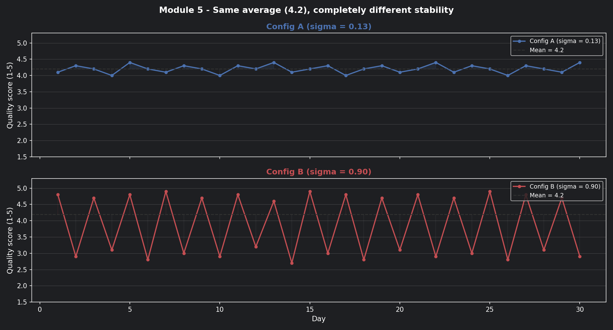
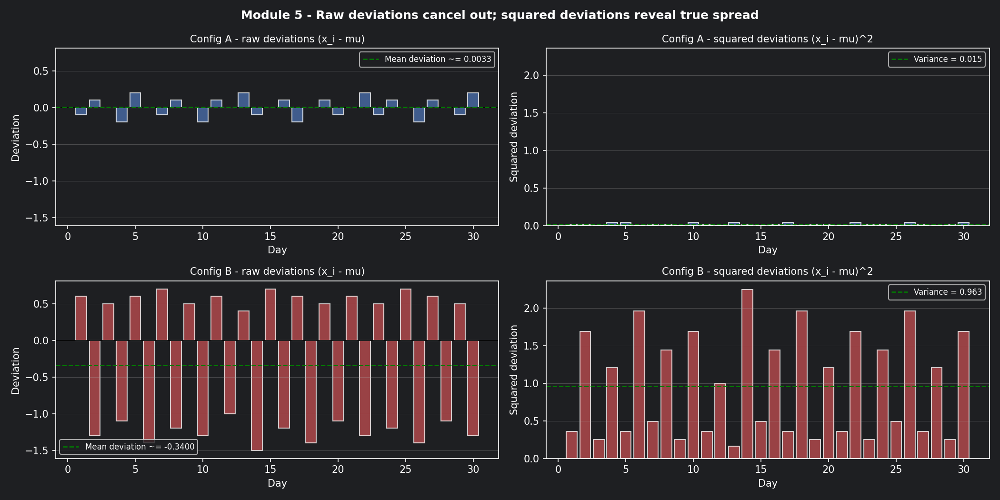
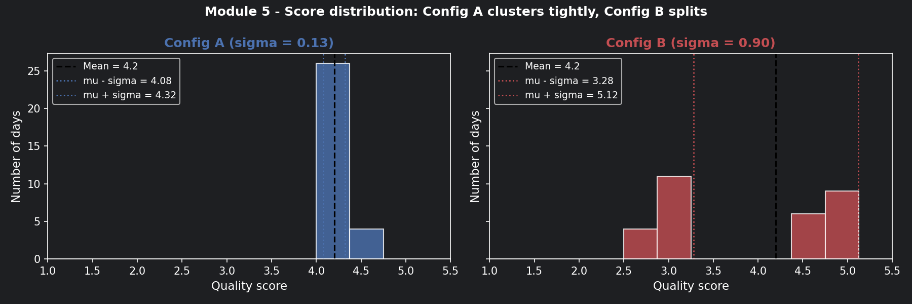
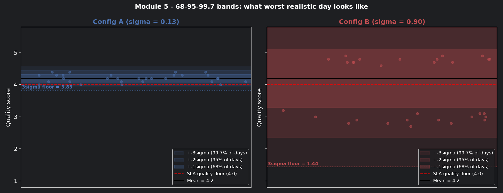
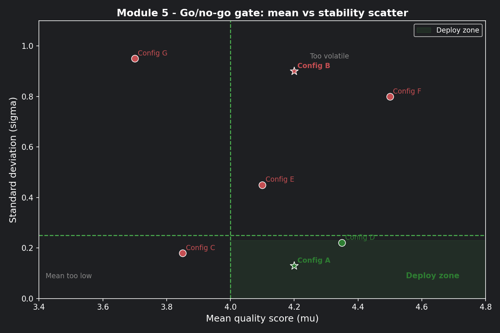

# Module 5: Variance and Standard Deviation

## The problem with averages

Your team has been running the Monday ticket through two different prompt configurations
for the past 30 days. Both are being evaluated on response quality (1–5 scale) and
routing accuracy (did it send the ticket to the right queue?).

The weekly report lands on your desk:

```
Prompt Config A:  avg quality = 4.2 / 5   avg routing accuracy = 87%
Prompt Config B:  avg quality = 4.2 / 5   avg routing accuracy = 87%
```

Identical. Your manager asks: "Which one do we deploy?"

You can't answer that question from averages alone. Here's what the averages are hiding:

```
Config A daily quality scores (30 days):
4.1, 4.3, 4.2, 4.0, 4.4, 4.2, 4.1, 4.3, 4.2, 4.0,
4.3, 4.2, 4.4, 4.1, 4.2, 4.3, 4.0, 4.2, 4.3, 4.1,
4.2, 4.4, 4.1, 4.3, 4.2, 4.0, 4.3, 4.2, 4.1, 4.4

Config B daily quality scores (30 days):
4.8, 2.9, 4.7, 3.1, 4.8, 2.8, 4.9, 3.0, 4.7, 2.9,
4.8, 3.2, 4.6, 2.7, 4.9, 3.0, 4.8, 2.8, 4.7, 3.1,
4.8, 2.9, 4.7, 3.0, 4.9, 2.8, 4.8, 3.1, 4.7, 2.9
```

Config B is oscillating wildly — great one day, terrible the next. Config A barely
moves. The averages are the same. The systems are completely different.

**Mean tells you where the centre is. Variance tells you how far things wander from it.**

---

### 📊 Visualisation 1 — 30 days of scores: the hidden story behind the average

This is the first chart to run. It shows both configs over 30 days with the mean
line drawn across both — so you can see that the same average hides completely
different behaviour.



---

## The math, built up from scratch

Start with the mean — the centre of your distribution:

$$
\mu = \frac{1}{n}\sum_{i=1}^{n} x_i
$$

For both configs: $\mu = 4.2$

Now measure how far each day's score wanders from that centre.
You can't just subtract and average — the positive and negative gaps cancel out.
So you **square** each gap first, then average:

$$
\mathrm{Var}(X) = \frac{1}{n}\sum_{i=1}^{n}(x_i - \mu)^2
$$

Squaring does two things: it eliminates negatives, and it penalises large swings
more than small ones (a gap of 2 contributes 4× more than a gap of 1).

Finally, take the square root to bring the units back to the original scale
(quality points, not quality points squared):

$$
\sigma = \sqrt{\mathrm{Var}(X)}
$$

This is your **standard deviation** — the typical distance any single day's score
sits from the average.

---

### 📊 Visualisation 2 — Squared deviations: why we square the gaps

This chart shows the gap between each day's score and the mean for both configs —
first raw (which cancels out), then squared (which reveals the true spread).
The visual makes the squaring step feel necessary rather than arbitrary.



---

## Calculated on our two configs

**Config A** (scores hovering between 4.0 and 4.4):

$$
\mathrm{Var}(A) = \frac{1}{30}\sum(x_i - 4.2)^2 \approx 0.017 \qquad \sigma_A \approx 0.13
$$

On any given day, Config A's quality score is typically within **±0.13** of 4.2.

**Config B** (scores bouncing between 2.7 and 4.9):

$$
\mathrm{Var}(B) = \frac{1}{30}\sum(x_i - 4.2)^2 \approx 0.81 \qquad \sigma_B \approx 0.90
$$

On any given day, Config B's quality score is typically within **±0.90** of 4.2 —
anywhere from 3.3 to 5.1 on a "normal" day.

| Config | Mean | Std Dev | Worst realistic day | Deploy? |
|---|---|---|---|---|
| A | 4.2 | 0.13 | ~3.94 | ✅ Stable |
| B | 4.2 | 0.90 | ~3.30 | ❌ Too volatile |

---

### 📊 Visualisation 3 — Score distributions: histogram comparison

This histogram shows where each config's scores actually land across 30 days.
Config A's scores pile up tightly around 4.2. Config B's scores split into
two humps — good days and bad days — with almost nothing in the middle.



---

## Now connect this to the Monday ticket

A security incident misrouted to a tier-1 agent isn't just a quality dip —
it's a potential breach.

Config B's routing accuracy bounces between 72% and 96% day-to-day (same average: 87%).
On a bad day with 500 tickets:

```
500 tickets × (1 - 0.72) = 140 misrouted tickets
5% are security incidents  =   7 active threats sent to wrong queue
```

Config A stays between 85% and 89%. Worst day: ~75 misrouted, 3–4 security incidents.
Not zero — but predictable enough to staff for.

**Stability isn't just a quality metric. It's a risk management metric.**

---

## What drives variance in prompt outputs?

**1. Ambiguous ticket language** — tickets mentioning multiple symptoms (account lock
+ VPN + patch notice) give the model more room to interpret differently on each run.
High-entropy tickets (Module 4) tend to produce high-variance outputs.

**2. Temperature settings** — higher temperature flattens the probability distribution
and increases randomness. A T=1.5 setting on a production classifier is asking for
Config B behaviour.

**3. Context window changes** — if conversation history grows and gets truncated
differently across runs (Module 1), the model sees a slightly different input each time.
Different input → different output → variance that looks random but isn't.

**The operational rule:** Diagnose *which* of these is driving variance before
changing anything. Lowering temperature when the real problem is truncated context
just masks the symptom.

---

## The 68-95-99.7 rule: your intuition calibrator

Once you have a standard deviation, this rule tells you what to expect:

- **68%** of days fall within **±1σ** of the mean
- **95%** of days fall within **±2σ** of the mean
- **99.7%** of days fall within **±3σ** of the mean

| Config | 95% range (±2σ) | 3σ floor (worst case) | SLA safe? |
|---|---|---|---|
| A (σ=0.13) | 3.94 – 4.46 | 3.81 | ✅ Yes |
| B (σ=0.90) | 2.40 – 6.00 | 1.50 | ❌ No |

The 3σ floor is your **worst-case planning number.** If it falls below your SLA
minimum quality threshold, the config should never reach production.

---

### 📊 Visualisation 4 — The 68-95-99.7 bands for both configs

This chart draws the σ, 2σ, and 3σ bands around the mean for both configs —
the most direct way to see what "worst realistic day" means in practice.



---

## The go/no-go decision framework

```
Gate 1 — Mean:       μ ≥ 4.0   (quality floor)
Gate 2 — Stability:  σ ≤ 0.25  (variance ceiling)
```

| Config | Gate 1 (μ ≥ 4.0) | Gate 2 (σ ≤ 0.25) | Decision |
|---|---|---|---|
| A | 4.2 ✅ | 0.13 ✅ | **Deploy** |
| B | 4.2 ✅ | 0.90 ❌ | **Do not deploy** |

---

### 📊 Visualisation 5 — The go/no-go gate as a scatter plot

Plot mean vs standard deviation for multiple prompt configs. The green quadrant
(high mean, low variance) is the deploy zone. Everything else is held back.
This chart becomes reusable for every future config evaluation.



---

## How to practice this

Open `notebooks/math-foundations/05_variance_stddev.ipynb` and work through:

1. Run Visualisation 1 — confirm with your own eyes that the averages look the same
   before the line charts reveal the difference
2. Calculate mean, variance, and standard deviation for Config A and B by hand,
   then verify against the `print()` output in Visualisation 1
3. Run Visualisation 4 — find the day in Config B's 30-day history where the score
   dropped below the SLA floor. How many such days were there?
4. Add two new configs to Visualisation 5 and place them in the scatter plot —
   do they land in the deploy zone?
5. Investigate: does Config B's daily variance correlate with average ticket
   entropy that day? (Hint: it should — high-entropy days drive high-variance outputs)

---

## Checklist before moving on

- [ ] Can you explain why two configs with the same average can be completely different in practice?
- [ ] Do your prompt evaluation reports always show standard deviation alongside mean?
- [ ] Have you set an explicit σ ceiling for your go/no-go deployment gate?
- [ ] Do you investigate the *source* of variance (temperature, truncation, ambiguity) before patching it?
- [ ] Are you tracking stability week-to-week, not just at deployment time?

---

## Where Module 6 picks up

We now know Config A is stable enough to deploy. But here's a new question:

> *"Run Config A on the Monday ticket twice — same ticket, same config.
> Do you get the same routing decision both times?"*

Sometimes yes. Sometimes no. It depends on whether the system is running in
deterministic or stochastic mode — and whether you made that choice deliberately.
That's what Module 6 is about.

--8<-- "_abbreviations.md"