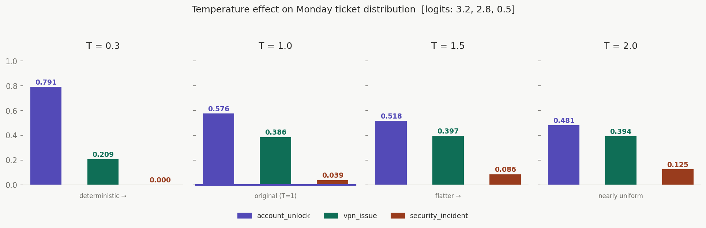
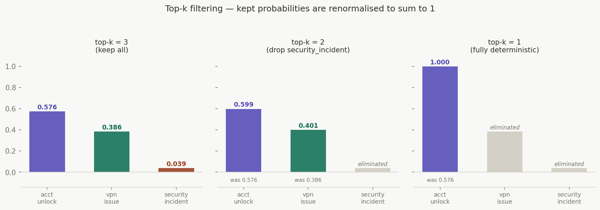
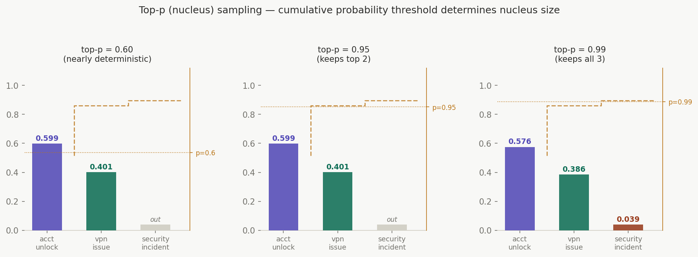

# Module 10 — Sampling Controls: reliability vs creativity

## Start here: what happens after softmax?

By Module 3 you had probabilities. By Module 4 you had entropy. By Module 6 you had the rule: deterministic for routing decisions, stochastic for draft generation.

Module 10 is where that rule gets operationalised. Once the model has produced a probability distribution, you have three levers that control what it's allowed to sample from — and how much randomness shapes the result.

Those levers are **temperature**, **top-k**, and **top-p**.

Getting them wrong doesn't break the system. It quietly degrades it. Classification outputs become unpredictable. Draft responses become repetitive, or incoherent, or both. And because nothing throws an error, you won't know until you audit.

---

## The Monday ticket: two jobs, two modes

After the classifier routes the Monday ticket to the clarification queue, the pipeline has a second job: generate three draft responses for the analyst to choose from.

These are fundamentally different tasks:

```
Job 1 — Intent classification (Module 6):
  argmax([0.576, 0.386, 0.039]) → account_unlock
  Same answer every time. Auditable. Deterministic.

Job 2 — Draft response generation:
  "How should we phrase the reply to this user?"
  Different valid answers exist. Creativity helps.
  Stochastic — but controlled.
```

The classification never uses sampling controls. It takes the argmax and stops.  
The draft generation uses sampling controls every time. This module is about how.

---

## Temperature: the first lever

Temperature reshapes the probability distribution *before* sampling. It does not change which class the model prefers — it changes how strongly the model commits to that preference.

Mathematically, temperature $T$ is applied to the logits before softmax:

$$
P(i) = \frac{e^{z_i / T}}{\sum_j e^{z_j / T}}
$$

Where $z_i$ are the logits. You saw these in Module 3: `[3.2, 2.8, 0.5]`.

What happens as $T$ changes:

| Temperature | Effect on distribution | Behaviour |
|:---|:---|:---|
| $T \to 0$ | One class approaches 1.0, rest approach 0 | Fully deterministic — always picks the top class |
| $T = 1.0$ | Original softmax distribution unchanged | Samples proportionally to trained probabilities |
| $T > 1.0$ | Distribution flattens — all classes get closer to equal | More randomness, less commitment to the top class |

Applied to the Monday ticket logits `[3.2, 2.8, 0.5]`:

```
T = 0.3  →  [0.874, 0.123, 0.003]   very sharp — account_unlock dominates
T = 1.0  →  [0.576, 0.386, 0.039]   original distribution
T = 1.5  →  [0.461, 0.376, 0.163]   flatter — security_incident creeping up
T = 2.0  →  [0.393, 0.353, 0.254]   nearly flat — three-way uncertainty
```

**The critical point:** at T = 2.0, `security_incident` goes from 3.9% to 25.4%. If you're using high temperature for *classification*, you've just created a meaningful chance of randomly escalating a routine unlock to the security team. High temperature is for generation, never for routing.



---

## Top-k: the second lever

Top-k filtering restricts sampling to the k highest-probability tokens, discarding the rest before sampling occurs.

After filtering, the retained probabilities are renormalised so they still sum to 1:

$$
P'(i) = \frac{P(i)}{\sum_{j \in S} P(j)} \quad \text{for } i \in S
$$

Where $S$ is the set of top-k classes kept after filtering.

Applied to the Monday ticket distribution `[0.576, 0.386, 0.039]`:

```
top-k = 3 (keep all):
  S = {account_unlock, vpn_issue, security_incident}
  P' = [0.576, 0.386, 0.039]   (unchanged — already sums to 1)

top-k = 2 (keep top 2):
  S = {account_unlock, vpn_issue}
  sum(S) = 0.576 + 0.386 = 0.962
  P' = [0.576/0.962, 0.386/0.962] = [0.599, 0.401]
  security_incident: eliminated

top-k = 1 (keep only top):
  S = {account_unlock}
  P' = [1.000]   → fully deterministic, equivalent to argmax
```

Top-k is useful when you want to eliminate genuinely bad or irrelevant options while still allowing some variation among the plausible ones.



---

## Top-p (nucleus sampling): the third lever

Top-p is more adaptive than top-k. Instead of fixing the number of options, you fix the *cumulative probability mass* you want to include, then take the smallest set of classes that reaches that threshold.

Sort classes by probability descending. Add them until the cumulative sum reaches $p$:

$$
S = \text{smallest set such that } \sum_{i \in S} P(i) \geq p
$$

Applied to `[0.576, 0.386, 0.039]` sorted descending:

```
top-p = 0.95:
  account_unlock:    0.576   cumsum = 0.576
  vpn_issue:         0.386   cumsum = 0.962  ← exceeds 0.95, stop here
  S = {account_unlock, vpn_issue}
  security_incident: eliminated

top-p = 0.99:
  account_unlock:    0.576   cumsum = 0.576
  vpn_issue:         0.386   cumsum = 0.962
  security_incident: 0.039   cumsum = 1.001  ← exceeds 0.99, stop here
  S = {account_unlock, vpn_issue, security_incident}
  All three retained

top-p = 0.60:
  account_unlock:    0.576   cumsum = 0.576
  vpn_issue:         0.386   cumsum = 0.962  ← already exceeds 0.60 after 1 class
  S = {account_unlock}
  → nearly deterministic
```

Top-p adapts to the shape of the distribution. When the model is confident (one class dominates), a moderate top-p naturally eliminates the weak alternatives. When the model is uncertain (several classes are similar), a moderate top-p keeps more options alive. This makes it more robust than top-k across varied inputs.



---

## The two profiles for the Monday ticket pipeline

These controls map directly to the two jobs identified in Module 6:

### Safe profile — compliance outputs

Used for: routing decisions, audit logs, SLA records, incident reports.  
Requirement: same output on the same input, every time.

```python
safe_profile = {
    "temperature": 0.0,   # deterministic — argmax
    "top_k":       1,     # only the top class
    "top_p":       1.0,   # no nucleus filtering needed
    "seed":        None,  # not applicable — output is deterministic
}
```

This is what runs when the pipeline classifies the Monday ticket as `account_unlock`.  
Run it 10,000 times. Get `account_unlock` 10,000 times.

### Creative profile — draft response generation

Used for: analyst draft suggestions, clarification question wording, user-facing responses.  
Requirement: varied, natural-sounding options for the analyst to choose from.

```python
creative_profile = {
    "temperature": 1.0,    # sample from the trained distribution
    "top_k":       50,     # allow up to 50 vocabulary options per token
    "top_p":       0.92,   # nucleus: keep options covering 92% of mass
    "seed":        8472,   # logged with every request for reproducibility
}
```

This is what generates the three draft responses:

```
seed: 8472, temperature: 1.0, top_p: 0.92

Draft 1: "Hi, I've raised a password reset — you'll receive an email shortly."
Draft 2: "Thanks for reaching out. Can you confirm whether this started
          after Friday's update?"
Draft 3: "I've flagged this for our security team given the patch notice
          you mentioned."
```

Three different, useful options. The seed is logged so all three can be reproduced exactly on demand — critical for audit trails if an analyst's choice is ever questioned.

---

## What goes wrong when profiles are misapplied

**High temperature on classification:**

At T = 1.5, `security_incident` climbs from 3.9% to 16.3%. Route 1,000 tickets with that temperature and roughly 163 of them randomly escalate to the security team as false positives. No error is thrown. The security team gets flooded with noise. This is the invisible failure mode.

**Low temperature on draft generation:**

At T = 0.3, the distribution becomes `[0.874, 0.123, 0.003]`. The model commits so hard to the most probable next token at every step that it produces nearly identical text across all three drafts. The analyst sees three versions of the same sentence. The variation that makes multiple drafts useful disappears.

**Unlogged seeds:**

At T = 1.0 without a logged seed, the three drafts cannot be reproduced. When a complaint comes in six months later — "why did the analyst send that response?" — you cannot reconstruct what options were presented. Reproducibility for stochastic steps requires logging the seed. Always.

---

## Connecting to entropy (Module 4)

Entropy and temperature interact directly. A high-entropy input (ambiguous ticket) with high temperature is doubly dangerous:

```
Low-entropy input (simple password reset):
  Distribution: [0.974, 0.024, 0.002]  H_norm = 0.09
  At T = 1.5:   [0.921, 0.065, 0.014]  H_norm = 0.18
  → still concentrated, risk is low

High-entropy input (Monday ticket):
  Distribution: [0.576, 0.386, 0.039]  H_norm = 0.74
  At T = 1.5:   [0.461, 0.376, 0.163]  H_norm = 0.89
  → nearly uniform, security_incident now sampled 1-in-6 times
```

The routing rule from Module 4 — "if H_norm ≥ 0.80 → escalate immediately" — would catch the T=1.5 version of the Monday ticket. But it catches it *after* temperature has already inflated the entropy. The correct fix is not to compensate downstream: it's to not apply high temperature to classification inputs in the first place.

**The rule:** entropy gates check the distribution *at T = 1.0* (the original softmax output). Temperature is only applied in the generation step, after routing is complete.

---

## Plugging back into the full pipeline

```
Ticket arrives
    │
    ▼
[M01] Tokenize
    │
    ▼
[M03] Logits → Softmax  (T = 1.0 — original distribution)
    │
    ▼
[M13] Segment check
    │
    ▼
[M02] Probability + margin check   (on original distribution)
    │
    ▼
[M04] Entropy check → routing decision   (on original distribution)
    │
    ├── clarification queue (Monday ticket)
    │
    ▼
[M10] Sampling controls applied  ← THIS MODULE
    → classification step:  safe_profile  (T=0.0, top_k=1)
    → generation step:      creative_profile  (T=1.0, top_p=0.92, seed logged)
    │
    ▼
[M14] Attribution flags generated
    │
    ▼
[M06] Three drafts presented to analyst
    │
    ▼
[M07] Resolution time estimate
    │
    ▼
Analyst reviews and decides
```

Sampling controls are the last configuration step before output is handed to a human. They do not change the classification decision — they shape how the model expresses itself in the generation step.

---

## Profile versioning

Sampling profiles are configuration, not code. Treat them accordingly:

```yaml
# sampling-profiles.yaml  — version controlled, reviewed on change

profiles:
  safe:
    description: "Compliance outputs, routing decisions, audit logs"
    temperature: 0.0
    top_k: 1
    top_p: 1.0
    last_changed: "2024-03-12"
    changed_by: "ops-team"
    reason: "Removed temperature floor — deterministic is now enforced"

  creative:
    description: "Draft responses, clarification questions, user-facing text"
    temperature: 1.0
    top_k: 50
    top_p: 0.92
    last_changed: "2024-02-28"
    changed_by: "product-team"
    reason: "Lowered top_p from 0.95 to 0.92 — reduced incoherent draft 3 rate"
```

A change to `top_p` from 0.95 to 0.92 is a model behaviour change. It should go through the same review process as a threshold change. It should appear in release notes. It should be validated against your evaluation suite (Module 12).

---

## Checklist

- [ ] Are classification steps always using the safe profile (T = 0.0 or argmax)?
- [ ] Are generation steps using the creative profile with a logged seed?
- [ ] Are sampling profiles documented by business use case, not just by parameter value?
- [ ] Are profile changes version-controlled and reviewed before deployment?
- [ ] Do profile changes trigger a re-run of your evaluation suite (Module 12)?
- [ ] Is entropy always checked against the T = 1.0 distribution — before temperature is applied?
- [ ] Are you monitoring output drift week-over-week after any sampling parameter change?

---

> Temperature controls how committed the model is to its top choice.
> Top-k and top-p control which choices are even on the table.
> Neither belongs in a classification step — and both belong in every generation step, documented and versioned.
>
> Module 11 adds the layer above this: once the model has generated an output, what hard rules determine whether it's allowed to proceed — regardless of how confident the model was?

--8<-- "_abbreviations.md"
